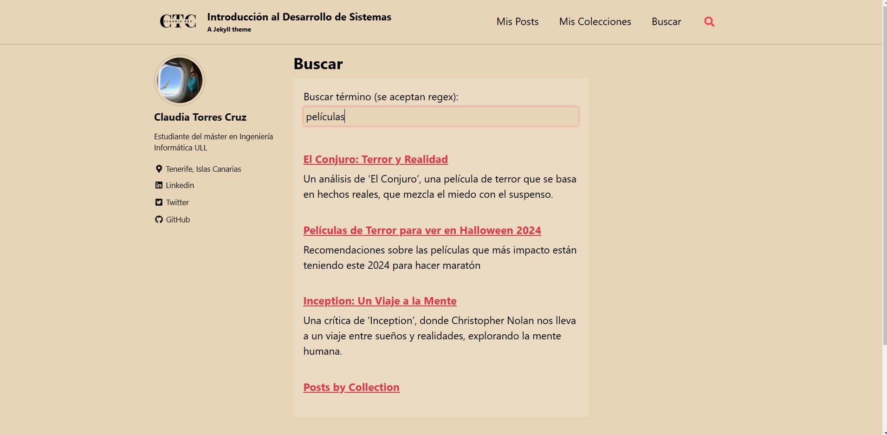
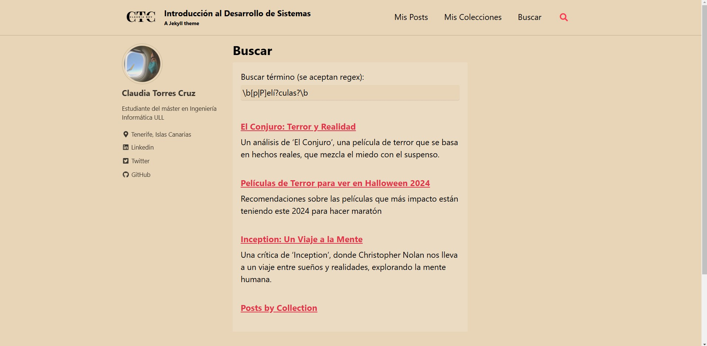
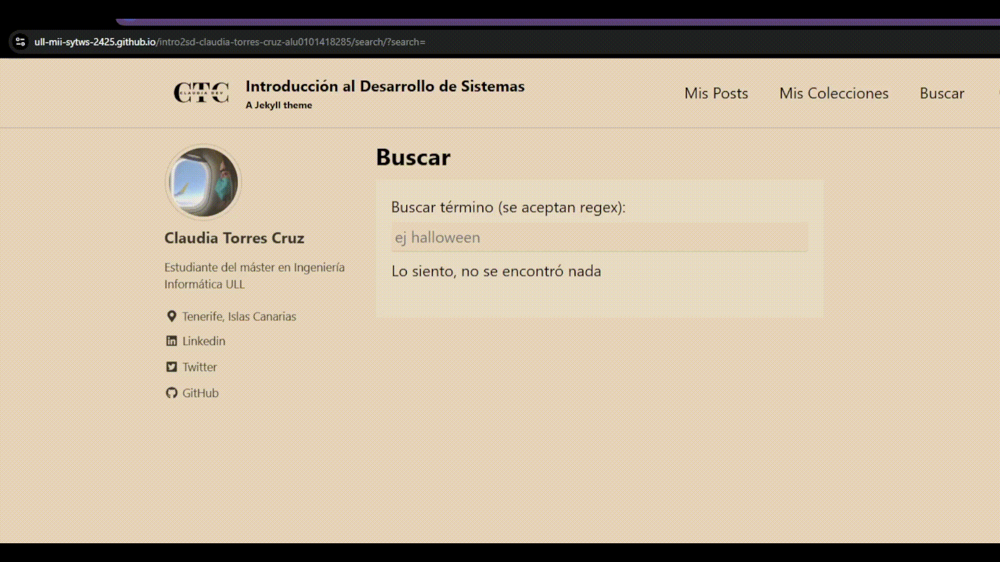

# Informe - Jekyll Search

[](https://github.com/ULL-MII-SYTWS-2425/intro2sd-claudia-torres-cruz-alu0101418285/actions/workflows/pages/pages-build-deployment)

## Estructura del Proyecto

1. `search.json`
   Durante la construcción del sitio, se genera un archivo JSON que contiene el contenido de las páginas, posts y colecciones del sitio para realizar las búsquedas.

   ```json
    ---
    layout: null
    sitemap: false
    ---

    
    [
      
      
        
        
          {
            "title": {{ doc.title | jsonify }},
            "excerpt": {{ doc.excerpt | markdownify | strip_html | jsonify }},
            "content": {{ doc.content | markdownify | strip_html | jsonify }},
            "url": {{ site.baseurl | append: doc.url | jsonify }}
          },
        
      
      
      

      
      {
        "title": {{ page.title | jsonify }},
        "excerpt": {{ page.excerpt | markdownify | strip_html | jsonify }},
        "content": {{ page.content | markdownify | strip_html | jsonify }},
        "url": {{ site.baseurl | append: page.url | jsonify }}
      },
      
    ]
    

    {{ json | lstrip }}
   ```

2. `search.md`
   Se ha creado una página de búsqueda personalizada, que incluye un formulario de búsqueda y muestra los resultados de manera dinámica mediante JavaScript.

   

   Que también admite regex

   

   Se realizan búsquedas mientras se teclea

   


3. `search.js`  y  `fetch.js` 
   El script search contiene la lógica para la búsqueda de contenido utilizando el archivo `search.json`. Además, el constructor de JekyllSearch recibe en un objeto los argumentos en vez de posicionalmente
    ```js
    class JekyllSearch {
      constructor({dataSource, searchField, resultsList, siteURL}) {
        // código
      }
      // otros métodos
    }
    ```
   El script fetch sirve para que aquellos navegadores antiguos que no tienen el fetch de forma nativa, puedan utilizarlo.


4. **Resumen del Capítulo 2**  
   El resumen del capítulo se encuentra en un post dentro del sitio `_posts/2024-12-01-resumencapitulo2.md`, donde se explican los tipos de ciclos de vida de los sistemas (SDLC), sus características y las metodologías ágiles.

## Resultados Esperados

- El usuario puede realizar búsquedas dinámicas en el sitio web, que muestran los resultados a medida que se escribe.
- Los resultados incluyen un enlace a las páginas o posts que contienen la expresión buscada y una descripción con los primeros caracteres del contenido.
- El resumen del Capítulo 2 del libro *Developing Information Systems* se muestra en un post dentro del sitio.

## Instalación y Ejecución

1. **Clonación del Repositorio:**

   Clona el repositorio con el siguiente comando:

   ```bash
   git clone <url-del-repositorio>
   cd <nombre-del-repositorio>
