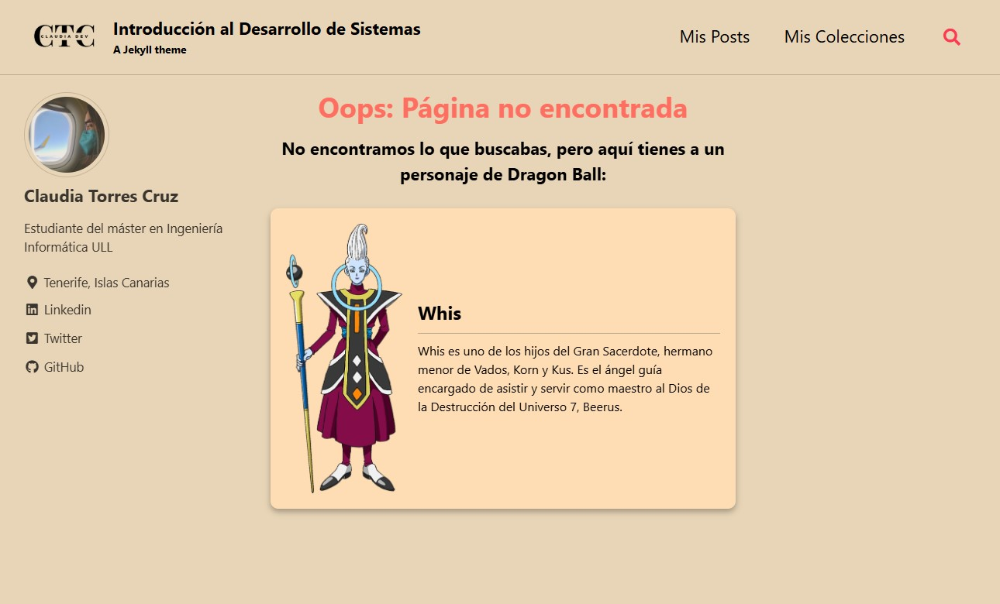
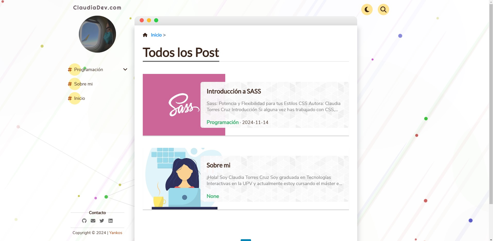

# Informe - Práctica Introduction to system development 

[](https://github.com/ULL-MII-SYTWS-2425/intro2sd-claudia-torres-cruz-alu0101418285/actions/workflows/pages/pages-build-deployment)

[](https://claudiadev-intro2sd.netlify.app/)

## Resumen del primer capítulo del libro
El resumen del primer capítulo del libro se encuentra en el apartado posts, el día 01/10/2022. En este apartado se ha usado Liquid para iterar sobre las etapas tecnológicas y para que al final del post aparezca como autora:

El front matter del archivo contiene:

```yml
author: "Claudia Torres Cruz"
stages:
  - Viabilidad del estudio
  - Requisitos de ingeniería
  - Diseño del sistema
  - Desarrollo del software
  - Implementación de la solución
```

Se utiliza Liquid para iterar sobre los elementos, colocarlos en una lista ordenada y añadir información extra en uno de los casos:

```md

  
1. **{{ stage }}** para analizar las necesidades tanto de la empresa como de los usuarios
  
1. **{{ stage }}**
  

```

También, para añadirme como autora al final de la página:

```md
Escrito por: {{ page.author }}
```

## Reconfiguración del archivo _config.yml

Se han ajustado los valores del archivo `_config.yml` para modificar:
- El nombre, el avatar y las URLs de contacto.

```yml
author:
  name             : *name 
  avatar           : "/assets/images/imagen_perfil.png"
  bio              : "Estudiante del máster en Ingeniería Informática ULL"
  location         : "Tenerife, Islas Canarias"
  links:
    - label: "Linkedin"
      icon: "fab fa-fw fa-linkedin"
      url: "https://www.linkedin.com/in/claudia-torres-cruz-6ab379267/"
    - label: "Twitter"
      icon: "fab fa-fw fa-twitter-square"
      url: "https://twitter.com/Claudia_TC2002"
    - label: "GitHub"
      icon: "fab fa-fw fa-github"
      url: "https://github.com/ClaudiaTC02"
```

- El footer y algunos iconos.

```yml
footer:
  links:
    - label: "Twitter"
      icon: "fab fa-fw fa-twitter-square"
      url: "https://twitter.com/Claudia_TC2002"
    - label: "GitHub"
      icon: "fab fa-fw fa-github"
      url: "https://github.com/ClaudiaTC02"
    - label: "Linkedin"
      icon: "fab fa-fw fa-linkedin"
      url: "https://www.linkedin.com/in/claudia-torres-cruz-6ab379267/"
```

```yml
logo                     : "/assets/images/logo-blog.png"
```

- El baseurl.

```yml
baseurl                  : "/intro2sd-claudia-torres-cruz-alu0101418285/"
```

- La skin del tema.

```yml
minimal_mistakes_skin    : "sunrise"
```

Además, también se ha añadido:
- La colección `_films`

```yml
  films:
    output: true
    permalink: /:collection/:path/
```

- Un front matter por defecto para esa colección.

```yml
  # _films
  - scope:
      path: ""
      type: films
    values:
      layout: single
      author_profile: false
      comments: true
      related: true  
```

## Uso de Datos Externos (CSV) en _data

Se incluyó un archivo CSV en la carpeta `_data` llamado `best-horror-films.csv` con la información sobre películas de terror. Este archivo contiene los campos Title, Year, Director, Genre, Duration, Description, y las plataformas en las que se encuentran. Una muestra del archivo es:

```csv
Title,Year,Genre,Duration,Description,Prime Video,Disney Plus,HBO Max,Netflix,Poster
"The Night House",2020,Horror,108,"Mientras intenta superar la inesperada muerte de su marido, Beth (Rebecca Hall) se queda a solas en una casa cerca de un lago especialmente diseñada para ella. Aunque hace todo lo posible por no perder la cordura, los sueños no tardan en aparecer. Las perturbadoras visiones de una presencia que llama por ella en la casa comienzan a ser cada vez más frecuentes. Aunque a la luz del día todo parece normal, Beth empieza lentamente a desesperarse, por lo que decide ignorar el consejo de sus amigos e investiga en sus pertenencias tratando de encontrar alguna respuesta. Allí se topa no sólo con secretos tan extraños como terribles, sino también con un misterio que está dispuesta a resolver.",true,true,false,false,https://www.themoviedb.org/t/p/w600_and_h900_bestv2/s6nLBypiujQQMBBfgJJAWleoWw1.jpg
"El último viaje del Demeter",2023,Horror,119,"Basado en un solo capítulo, el Captain's Log, de la clásica novela Drácula de 1897 de Bram Stoker, la historia se desarrolla a bordo de la goleta rusa Demeter, que fue fletada para transportar carga privada (veinticuatro cajas de madera sin marcar) desde Carpatia a Londres. La película detallará los extraños eventos que acontecieron a la tripulación condenada mientras intentan sobrevivir al viaje por el océano, acechados cada noche por una aterradora presencia a bordo del barco. Cuando finalmente llegó cerca del puerto de Whitby, estaba totalmente en ruinas. No había rastro de la tripulación.",true,false,false,false,https://www.themoviedb.org/t/p/w600_and_h900_bestv2/jdqd4i1nY5q7ZCK4Tpb7wDFgzNs.jpg
```
Para automatizar la presentación de películas en función de su disponibilidad en las plataformas de streaming se ha usado este archivo y Liquid. Dentro de la colección creada anteriormente, `_films`, se ha añadido un archivo que itera sobre la colección de películas y muestra información sobre la misma con los logotipos de las plataformas en la que está disponible:

```md

<div class="pelicula">
  
  <div class="pelicula-details">
    <h3 class="pelicula-title">{{ pelicula.Title }}</h3>
    <div class="pelicula-info">
      <p><strong>Año:</strong> {{ pelicula.Year }}</p>
      <p><strong>Género:</strong> {{ pelicula.Genre }}</p>
      <p><strong>Duración:</strong> {{ pelicula.Duration }} minutos</p>
    </div>
    <div class="plataformas">
      
      
      

      
      
      

      
      
      

      
      
      
    </div>
  </div>
</div>
<p class="pelicula-description"><strong>Descripción: </strong>{{ pelicula.Description }}</p>
<hr>

```

## Página 404 personalizada
Se ha creado una página 404 personalizada que muestra un mensaje de error y un personaje aleatorio de Dragon Ball con una breve descripción usando la API de `https://web.dragonball-api.com/` cuando el usuario navegue a una URL incorrecta. 

Se encuentra dentro de la carpeta _pages `404.md` .



## Despliegue en Netlify o Vercel
Se ha elegido Netlify para realizar el despliegue de la aplicación, para ello primero se ha generado un `fork` de este mismo repositorio en mi cuenta personal.

Después se han modificado cuestiones relacionadas con la versión de las gemas que dieron algunos problemas y en el archivo ´_config.yml´ se ha cambiado la ruta en la que debe buscar los archivos, esto se hace para que tanto los estilos como las imagenes se muestren adecuadamente.

```yml
url                      : https://claudiadev-intro2sd.netlify.app/
baseurl                  : "" 
repository               : "ULL-MII-SYTWS-2425/intro2sd-claudia-torres-cruz-alu0101418285"
```
Puede acceder a la página desde el botón que se encuentra en el principio del README o haciendo [click aquí](https://claudiadev-intro2sd.netlify.app/)

## Creación página personal
Con los conocimientos adquiridos en esta práctica se ha creado un blog personal para ir añadiendo posts sobre las tecnologías que conozco. Se ha añadido al perfil personal como enlace, aunque también puede acceder haciendo [click aquí](https://claudiatc02.github.io/)

